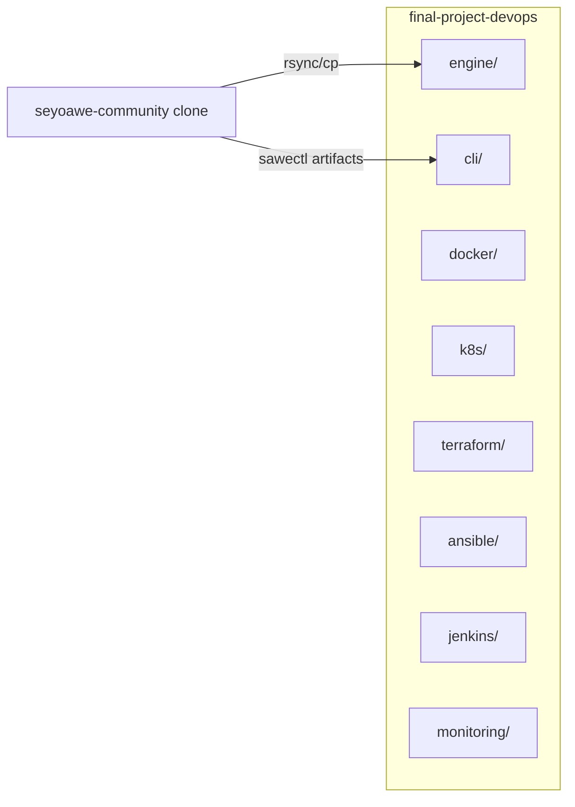

# 0001 — Phase 1: Repository & Environment Setup

## 1. Background & Problem

The DevOps coursework targets **SeyoAWE Community** as the application under automation. Today, application source lives only in a separate clone (`seyoawe-community`); `final-project-devops` holds plans, diagrams, and rules but no runnable `engine/` or `cli/` tree. Without a normalized layout, later phases (Docker, Jenkins, Terraform) cannot reference stable paths. The upstream `configuration/config.yaml` uses `./seyoawe-community/...` paths that assume a monorepo layout; after copying into `engine/`, those paths would break if the engine is launched with `engine/` as CWD.

**Root cause:** No consolidated application tree in the infra repo + path contract mismatch between upstream config and target directory layout.

## 2. Questions & Answers

| Question | Answer |
|----------|--------|
| Should `cli/` mirror `sawectl/` as a flat directory? | **Yes.** `sawectl.py` resolves schemas via `os.path.dirname(__file__)`; `dsl.schema.json` and `module.schema.json` must sit beside `sawectl.py`. |
| Copy engine binary from upstream? | **No.** Binaries are not in git; document manual placement under `engine/`. |
| Track empty infra dirs (`docker/`, `k8s/`, …)? | **Yes.** Add `.gitkeep` so Git records the skeleton until Phase 2–6 populate them. |
| Adjust `config.yaml` after copy? | **Yes.** Rewrite `directories.*` to paths relative to `engine/` (`.`, `./modules`, `./workflows`, `./lifetimes`, `./logs`) so `run.sh` + binary behave when run from `engine/`. |

## 3. Design & Solution

### Layout



### Contracts

- **Engine:** `engine/run.sh`, `engine/configuration/config.yaml`, `engine/modules/**`, `engine/workflows/**`. Optional: `engine/seyoawe.linux` (manual).
- **CLI:** `cli/sawectl.py`, `cli/requirements.txt`, `cli/dsl.schema.json`, `cli/module.schema.json`.
- **Version:** Root `VERSION` file — single line semver, no BOM, no trailing newline variance (exactly `0.1.0\n`).

### Path fix (post-copy)

`directories` in `engine/configuration/config.yaml`:

```yaml
directories:
  workdir: .
  modules: ./modules
  workflows: ./workflows
  lifetimes: ./lifetimes
  logs: ./logs
```

Create `engine/lifetimes/` and `engine/logs/` with `.gitkeep` if missing.

## 4. Implementation Plan

1. Scan `.cursor/design-logs/` → highest prefix; create `0001_phase1_repo_setup.md` (empty dir → `0001`).
2. `mkdir -p` top-level: `engine`, `cli`, `docker`, `k8s`, `terraform`, `ansible`, `jenkins`, `monitoring`.
3. Copy from `~/CProjects/seyoawe-community`:
   - `run.sh`, `configuration/`, `modules/`, `workflows/` → `engine/`
   - `sawectl/sawectl.py`, `requirements.txt`, `dsl.schema.json`, `module.schema.json` → `cli/`
4. Patch `engine/configuration/config.yaml` `directories` block as above; ensure `lifetimes/`, `logs/` exist.
5. Add `.gitkeep` under empty skeleton dirs (`docker`, `k8s`, `terraform`, `ansible`, `jenkins`, `monitoring`).
6. Write root `VERSION` (`0.1.0`), `.gitignore`, `README.md`.
7. Append **Implementation Results** after execution (append-only).

### Commands (reference)

```bash
SRC=~/CProjects/seyoawe-community
DST=~/CProjects/final-project-devops
cp "$SRC/run.sh" "$DST/engine/"
cp -R "$SRC/configuration" "$DST/engine/"
cp -R "$SRC/modules" "$DST/engine/"
cp -R "$SRC/workflows" "$DST/engine/"
cp "$SRC/sawectl/sawectl.py" "$SRC/sawectl/requirements.txt" \
   "$SRC/sawectl/dsl.schema.json" "$SRC/sawectl/module.schema.json" "$DST/cli/"
```

## 5. Examples

- ✅ `cli/sawectl.py` and `cli/dsl.schema.json` siblings → schema load works.
- ❌ Only `cli/sawectl.py` without JSON schemas → runtime failure on `validate-workflow`.
- ✅ `VERSION` contains exactly `0.1.0` one line.
- ❌ `VERSION` with `v0.1.0` or extra prose → breaks semver consumers in later phases.

## 6. Trade-offs

| Alternative | Why not |
|-------------|---------|
| Git submodule for `seyoawe-community` | Course asks for copies under `engine/`/`cli/`; simpler grading and Docker context. |
| Leave upstream `./seyoawe-community` paths | Engine would not resolve modules/workflows when CWD is `engine/`. |

## 7. Verification Criteria

- [ ] All listed directories exist; skeleton dirs tracked via `.gitkeep`.
- [ ] `engine/run.sh` executable (`chmod +x`).
- [ ] `cli/sawectl.py --help` runs (requires `pip install -r cli/requirements.txt` in a venv).
- [ ] No duplicate/conflicting copies of LICENSE inside `engine/` beyond what upstream had (acceptable if copied with `modules/`).
- [ ] `VERSION` reads `0.1.0`.

---

## Implementation Results

_(Append-only below this line; do not edit sections 1–7 above.)_

**When:** 2026-03-27 (agent run, Phase 1).

### What was done

- Scanned `.cursor/design-logs/`: empty → created `0001_phase1_repo_setup.md`.
- Created top-level dirs: `engine/`, `cli/`, `docker/`, `k8s/`, `terraform/`, `ansible/`, `jenkins/`, `monitoring/` with `.gitkeep` on empty skeleton dirs.
- Copied from `~/CProjects/seyoawe-community` into `engine/`: `run.sh`, `configuration/`, `modules/`, `workflows/`; `chmod +x engine/run.sh`.
- Copied into `cli/`: `sawectl.py`, `requirements.txt`, `dsl.schema.json`, `module.schema.json`; `chmod +x cli/sawectl.py`.
- Created `engine/lifetimes/`, `engine/logs/` with `.gitkeep`.
- Patched `engine/configuration/config.yaml` `directories` block to paths relative to `engine/` CWD (see §3).
- Root `VERSION` = `0.1.0` (one line). Root `.gitignore` and `README.md` added.
- Local venv `.venv/` (gitignored): `pip install -r cli/requirements.txt` → `sawectl.py --help` succeeds.

### Test / verification notes

- CLI smoke: **pass** after venv install (`--help` prints usage).
- Engine binary: **not verified** (binary not in repo by design).

### Deviations from §3

- None beyond `engine/configuration/config.yaml` `directories` alignment for `engine/` CWD.
