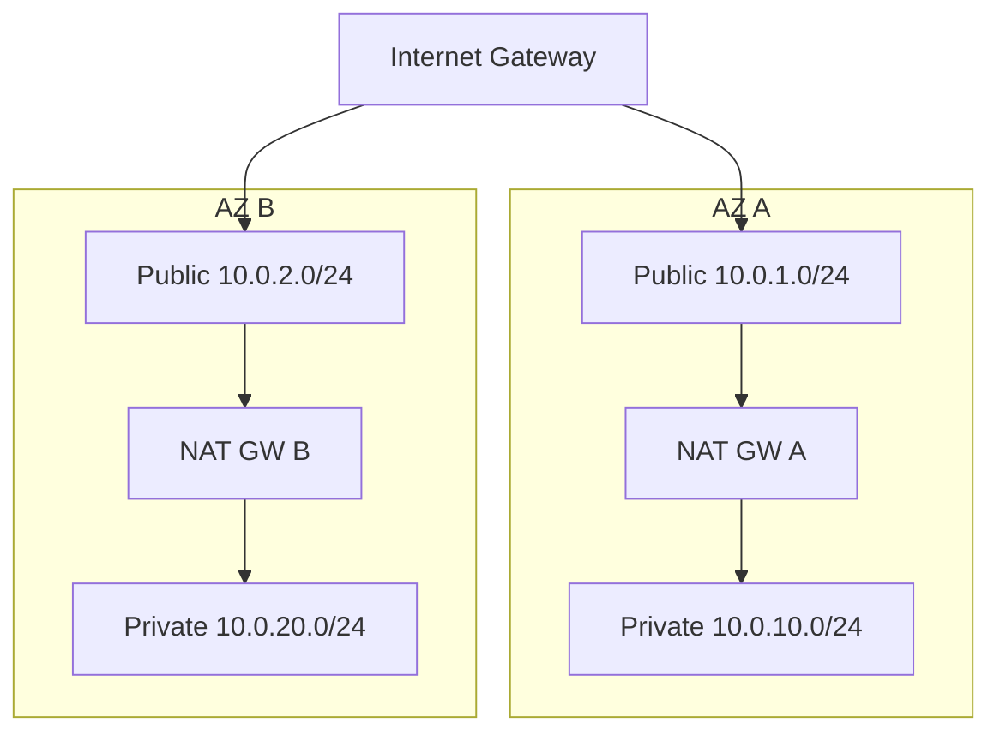
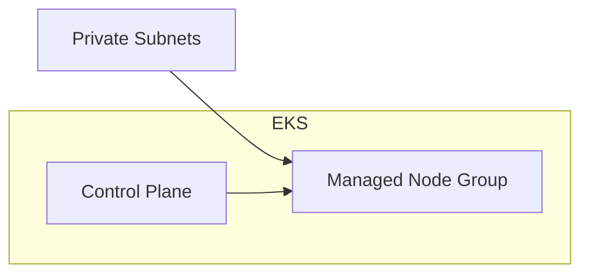

# 0002 — Phase 2: AWS Infrastructure (Terraform & Ansible)

## 1. Background & Problem

Phase 5 requires a repeatable AWS footprint: a VPC suitable for EKS, a managed Kubernetes cluster, and IAM identities Terraform can assume to create EKS cluster roles, node instance roles, and (later) IRSA for Jenkins. Terraform state must be **shared and locked** so `terraform apply` from CI or multiple operators does not corrupt state. Without a remote backend (S3) and lock table (DynamoDB), state lives on disk and concurrent applies risk split-brain.

**Root cause:** No remote state contract + no codified network/compute identity layer yet.

## 2. Questions & Answers

| Question | Answer |
|----------|--------|
| Single region? | **Yes for v1** — pick one primary region (e.g. `us-east-1`); all resources and backend in that region. |
| EKS visibility? | **Private API + private nodes** preferred; public endpoint optional for bootstrap until bastion/VPN exists. Document choice in `terraform.tfvars` when modules land. |
| NAT strategy? | **One NAT GW per AZ** (diagram 005) for HA; cost trade-off accepted for coursework realism. |
| IAM for `terraform-deployer`? | **Bootstrap:** either `AdministratorAccess` (fastest for lab) or a **scoped** policy combining state backend + full EKS/VPC permissions (see §6). |
| Ansible scope in Phase 2? | **Post-apply:** install `kubectl`/`helm`, merge kubeconfig, optional namespace prep — no Ansible until after EKS endpoint is known. |

## 3. Design & Solution

### 3.1 Remote state backend (bootstrap before any `.tf` in repo)

| Resource | Name pattern | Purpose |
|----------|--------------|---------|
| S3 bucket | `seyoawe-tf-state-<account-id>` | Versioned object store for `terraform.tfstate` |
| DynamoDB table | `seyoawe-tf-lock` | Partition key `LockID` (String) — Terraform state locking |
| IAM user | `terraform-deployer` | Human/CI principal whose keys map to profile `seyoawe-tf` |

**Terraform `backend` block (reference only — not committed until `aws-ready`):**

```hcl
terraform {
  backend "s3" {
    bucket         = "seyoawe-tf-state-<account-id>"
    key            = "dev/eks/terraform.tfstate"
    region         = "<region>"
    dynamodb_table = "seyoawe-tf-lock"
    encrypt        = true
  }
}
```

**S3 hardening (manual or follow-up):** versioning ON, block public access ON, default encryption (SSE-S3 or SSE-KMS).

### 3.2 VPC (Terraform module `terraform/modules/vpc/` — *planned, not implemented yet*)

- CIDR: `10.0.0.0/16`
- **AZs:** 2 (e.g. `a`, `b`)
- **Public subnets:** `10.0.1.0/24`, `10.0.2.0/24` — IGW, NAT GWs, load balancers
- **Private subnets:** `10.0.10.0/24`, `10.0.20.0/24` — EKS worker nodes
- **Routing:** public → IGW; private → respective AZ NAT
- **Tags:** `kubernetes.io/cluster/<cluster-name>=shared`, `kubernetes.io/role/elb=1` on public subnets for ALB/NLB controller compatibility



### 3.3 EKS (Terraform module `terraform/modules/eks/` — *planned*)

- **Control plane:** AWS-managed EKS in the same region
- **Node group:** managed, 2–3 × `t3.medium` (or `t3.large` if headroom needed), in **private** subnets
- **Addons:** `vpc-cni`, `kube-proxy`, `coredns` (EKS-managed addon versions pinned)
- **Access:** cluster creator principal; later map `terraform-deployer` or SSO role via `aws-auth` ConfigMap / EKS access entries API



### 3.4 IAM (Terraform module `terraform/modules/iam/` — *planned*)

| Role | Trust | Use |
|------|-------|-----|
| Cluster IAM role | `eks.amazonaws.com` | EKS control plane |
| Node IAM role | `ec2.amazonaws.com` | Worker nodes; attach `AmazonEKSWorkerNodePolicy`, `AmazonEKS_CNI_Policy`, `AmazonEC2ContainerRegistryReadOnly` |
| IRSA (later) | OIDC federation | Jenkins / external-secrets — Phase 4/5 |

### 3.5 Ansible (after cluster exists)

- **Inventory:** dynamic or static list of `localhost` + `ansible_connection=local` for kubeconfig merge
- **Playbooks:** `install-tools.yaml` (kubectl, helm), `configure-eks.yaml` (`aws eks update-kubeconfig`, `kubectl get nodes`)
- **No** Ansible changes until EKS API is reachable with `seyoawe-tf` (or assumed role) credentials

## 4. Implementation Plan (post–`aws-ready`)

1. Add `terraform/environments/dev/backend.tf` with S3 backend (bucket/key/region/table from §3.1).
2. Implement `terraform/modules/vpc/` → wire from `terraform/environments/dev/main.tf`.
3. Implement `terraform/modules/iam/` (cluster + node roles) → wire before EKS.
4. Implement `terraform/modules/eks/` → depends on VPC + IAM.
5. `terraform init -backend-config=...` or embedded backend; `terraform plan` / `apply`.
6. Add `ansible/inventory/`, `ansible/playbooks/` as in master plan; run against control machine.

## 5. Examples

- ✅ S3 bucket name includes **numeric account ID** → globally unique.
- ❌ Reusing a generic bucket name like `seyoawe-tf-state` without account suffix → collision across accounts.
- ✅ DynamoDB **PAY_PER_REQUEST** for lock table → no capacity planning for coursework traffic.
- ❌ Lock table with numeric partition key → Terraform expects string `LockID`.

## 6. Trade-offs

| Choice | Rationale |
|--------|-----------|
| `AdministratorAccess` on `terraform-deployer` | Fastest path for a student account; **not** for shared prod accounts. |
| Scoped IAM policy | More JSON to maintain; mirrors least-privilege production practice. |
| 2 NAT GWs | HA + cost vs single NAT for lab-only savings. |

## 7. Verification Criteria

- [ ] `aws sts get-caller-identity --profile seyoawe-tf` returns the expected account.
- [ ] `aws s3 ls s3://seyoawe-tf-state-<account-id>/ --profile seyoawe-tf` succeeds.
- [ ] `aws dynamodb describe-table --table-name seyoawe-tf-lock --profile seyoawe-tf` shows `LockID` HASH key.
- [ ] After modules exist: `terraform init` initializes S3 backend without error; `terraform plan` runs.

---

## Implementation Results

_(Append only after bootstrap + IaC execution.)_
