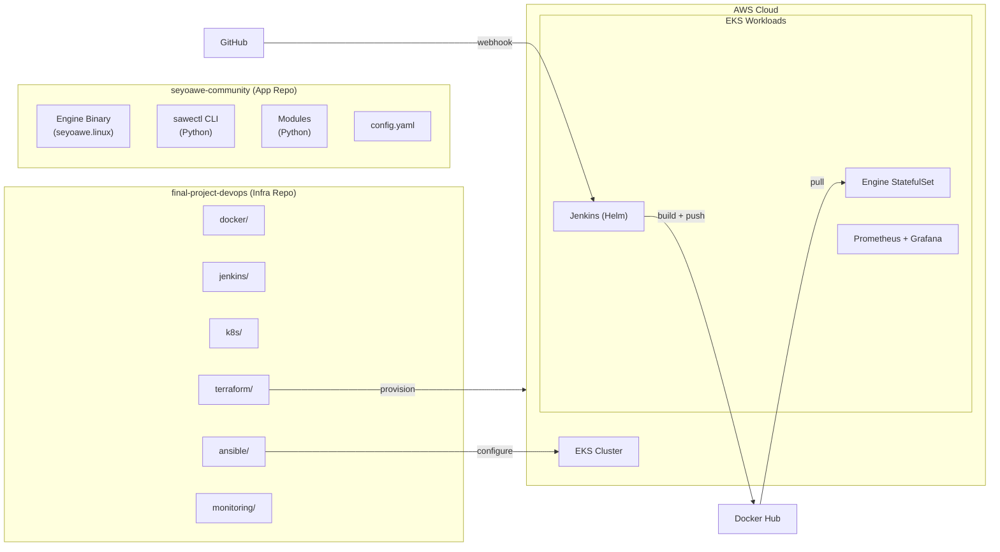
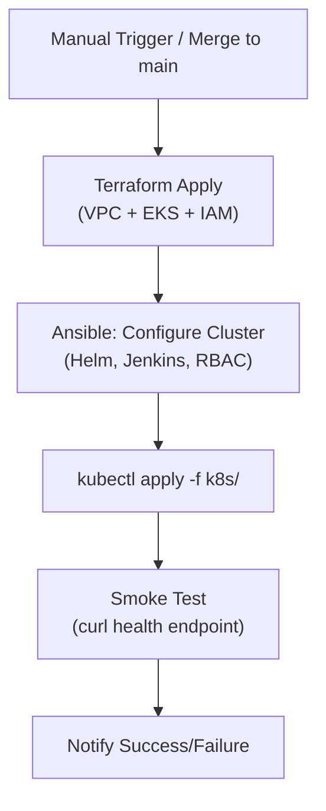
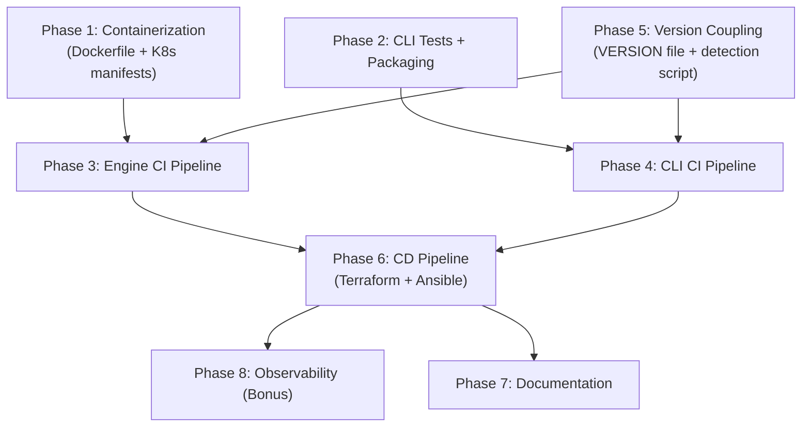

# DevOps Final Project -- Full Lifecycle Execution Plan

## Architecture Overview




---

## Repository Structure (final-project-devops)

```
final-project-devops/
  .instructions/              # existing project instructions
  docker/
    engine/Dockerfile         # Engine container (Linux binary + modules + config)
    cli/Dockerfile            # CLI packaging container
  jenkins/
    Jenkinsfile.engine-ci     # CI pipeline for engine
    Jenkinsfile.cli-ci        # CI pipeline for CLI
    Jenkinsfile.cd            # CD pipeline (deploy)
  k8s/
    namespace.yaml
    engine-statefulset.yaml   # StatefulSet + PVC + Service
    engine-configmap.yaml
    engine-service.yaml
  terraform/
    main.tf                   # VPC + EKS + IAM + node groups
    variables.tf
    outputs.tf
    providers.tf
    backend.tf                # S3 remote state
    modules/
      vpc/
      eks/
  ansible/
    inventory/
      aws_ec2.yml             # dynamic inventory
    playbooks/
      configure-cluster.yml   # post-provision config
      deploy-app.yml          # app deployment
    roles/
      common/
      k8s-setup/
  monitoring/
    prometheus/
      values.yaml             # Helm values for kube-prometheus-stack
    grafana/
      dashboards/
        engine-dashboard.json
  tests/
    integration/
      test_engine_api.py      # Integration tests against engine HTTP API
    cli/
      test_sawectl.py         # Unit tests for sawectl
  scripts/
    version.sh                # Shared version management script
  VERSION                     # Single source of truth for semantic version
  README.md
```

---

## Phase 1: Containerization and Engine Deployment (10 pts)

### 1.1 Engine Dockerfile

Location: `docker/engine/Dockerfile`

Strategy: Package the pre-compiled `seyoawe.linux` binary with its runtime dependencies (modules, configuration, workflows).

```dockerfile
FROM ubuntu:22.04
RUN apt-get update && apt-get install -y python3 python3-pip curl && rm -rf /var/lib/apt/lists/*
WORKDIR /app
COPY seyoawe.linux ./seyoawe
COPY configuration/ ./configuration/
COPY modules/ ./modules/
COPY workflows/ ./workflows/
RUN chmod +x ./seyoawe
EXPOSE 8080 8081
HEALTHCHECK --interval=30s --timeout=5s --retries=3 CMD curl -f http://localhost:8080/health || exit 1
ENTRYPOINT ["./seyoawe"]
```

Key decisions:

- Base image: `ubuntu:22.04` (matches CI/CD diagram reference)
- Engine listens on port `8080` (from `configuration/config.yaml` line 14)
- Module dispatcher on port `8081` (from `configuration/config.yaml` line 22)
- Health probe via HTTP (engine is Flask-based per README)

### 1.2 Kubernetes StatefulSet

Location: `k8s/engine-statefulset.yaml`

- StatefulSet (as required by instructions, line 28)
- `volumeClaimTemplates` for persistent storage (logs, lifetimes)
- Readiness probe: HTTP GET `/health` on port 8080
- Liveness probe: HTTP GET `/health` on port 8080
- ConfigMap for `config.yaml` mounted at `/app/configuration/`
- Service: ClusterIP exposing 8080 and 8081

### 1.3 Engine Service and ConfigMap

- `k8s/engine-service.yaml`: ClusterIP Service
- `k8s/engine-configmap.yaml`: Externalized config.yaml with environment-specific overrides

---

## Phase 2: CLI Testing and Packaging (10 pts)

### 2.1 Unit Tests for sawectl

Location: `tests/cli/test_sawectl.py`

Target: `sawectl/sawectl.py` (VERSION = "0.0.1", 633 lines)

Test coverage areas:

- `load_yaml()` -- valid/invalid YAML parsing
- `validate_against_schema()` -- schema validation pass/fail
- `extract_module_and_method()` -- action string parsing
- `validate_step()` -- step validation logic
- `init_module_from_schema()` -- module scaffold generation
- `init_workflow()` -- workflow generation (minimal and full)
- CLI argument parsing (argparse)

Framework: `pytest` with `pytest-cov`

### 2.2 CLI Dockerfile (Packaging)

Location: `docker/cli/Dockerfile`

```dockerfile
FROM python:3.10-slim
WORKDIR /app
COPY sawectl/ ./
RUN pip install --no-cache-dir -r requirements.txt
ENTRYPOINT ["python3", "sawectl.py"]
```

### 2.3 CLI Artifact

- Package as a pip-installable artifact or standalone binary (PyInstaller)
- Publish version-tagged artifact alongside Docker image

---

## Phase 3: CI Pipeline for Engine (15 pts)

Location: `jenkins/Jenkinsfile.engine-ci`

Pipeline stages (matching CI/CD diagram from `.instructions/ci_cd_jenkins.png`):

```
GitHub Checkout -> Integration Tests -> Docker Build -> Semantic Version Tag -> Push to Docker Hub -> Notify (Success/Fail)
```

### Stage details:

1. **Checkout**: Clone `seyoawe-community` repo
2. **Integration Tests**: Spin up engine container locally, run `tests/integration/test_engine_api.py` against it
  - Test health endpoint
  - Test workflow submission via `/api/adhoc`
  - Test module validation endpoints
  - Teardown container after tests
3. **Docker Build**: Build `docker/engine/Dockerfile` with build args for version
4. **Version Tag**: Read from `VERSION` file, apply semantic version tag to image
5. **Push to Docker Hub**: `<namespace>/seyoawe-engine:<version>`
6. **Notification**: On failure -> email/Slack (per CI/CD diagram)

### Trigger:

- On push/PR to `main` branch
- Only when engine-related files change (engine binary, modules, configuration, docker/engine/)

---

## Phase 4: CI Pipeline for CLI (10 pts)

Location: `jenkins/Jenkinsfile.cli-ci`

Pipeline stages:

1. **Checkout**: Clone `seyoawe-community` repo
2. **Lint**: `flake8` or `pylint` on `sawectl/`
3. **Unit Tests**: `pytest tests/cli/ --cov=sawectl`
4. **Package**: Build distributable (wheel or PyInstaller binary)
5. **Docker Build**: Build `docker/cli/Dockerfile`
6. **Version Tag**: Read from shared `VERSION` file
7. **Push to Docker Hub**: `<namespace>/seyoawe-cli:<version>`
8. **Artifact Archive**: Store test results and coverage reports

### Trigger:

- On push/PR to `main` branch
- Only when CLI-related files change (sawectl/, docker/cli/, tests/cli/)

---

## Phase 5: Version Coupling Logic (15 pts)

### Strategy: Single `VERSION` file as source of truth

Location: `VERSION` (root of `final-project-devops`)

- Contains a single semantic version string (e.g., `0.1.0`)
- Both engine CI and CLI CI pipelines read from this file
- Version is injected at build time via Docker `--build-arg` and image tags

### Change detection script

Location: `scripts/version.sh`

Logic:

- Compare `HEAD` against last tag to detect which components changed
- If only `sawectl/` changed -> trigger CLI pipeline only
- If only engine-related files changed -> trigger engine pipeline only
- If `VERSION` file changed -> trigger both pipelines
- Prevents unnecessary rebuilds (instruction line 37: "avoid unnecessary rebuilds")

### Version bump:

- `VERSION` file bump triggers both pipelines
- Git tag `v<version>` created on successful build
- Docker images tagged: `<version>`, `latest`

---

## Phase 6: CD Pipeline -- Terraform + Ansible (20 pts)

Location: `jenkins/Jenkinsfile.cd`

### 6.1 Terraform (Infrastructure Provisioning)

Location: `terraform/`

Resources to provision on AWS:

- **VPC**: Public/private subnets across 2 AZs
- **EKS Cluster**: Managed control plane
- **Node Group**: 2-3 `t3.medium` worker nodes (auto-scaling)
- **IAM Roles**: EKS cluster role, node instance role, Jenkins service account
- **Security Groups**: Ingress for 8080, 443; internal cluster comms
- **S3 Bucket**: Terraform remote state backend
- **ECR** (optional, if not using Docker Hub exclusively)

Terraform modules:

- `terraform/modules/vpc/` -- VPC, subnets, NAT gateway, IGW
- `terraform/modules/eks/` -- EKS cluster, node groups, OIDC

State management: S3 backend with DynamoDB locking (`terraform/backend.tf`)

### 6.2 Ansible (Configuration Management)

Location: `ansible/`

Playbooks:

- `playbooks/configure-cluster.yml`:
  - Install/configure `kubectl`, `helm` on bastion/CI node
  - Deploy Jenkins via Helm chart (`jenkins/jenkins` chart)
  - Deploy monitoring stack via Helm
  - Apply K8s RBAC policies
  - Configure Jenkins credentials (Docker Hub, GitHub)
- `playbooks/deploy-app.yml`:
  - Apply K8s manifests from `k8s/`
  - Verify rollout status
  - Run post-deployment smoke tests

Dynamic inventory: `ansible/inventory/aws_ec2.yml` (using `amazon.aws.aws_ec2` plugin)

### 6.3 CD Pipeline Flow




---

## Phase 7: Code Structure and Documentation (10 pts)

- `README.md` at repo root: architecture overview, setup instructions, pipeline descriptions
- Each subdirectory (`docker/`, `jenkins/`, `k8s/`, `terraform/`, `ansible/`, `monitoring/`) gets a brief `README.md`
- Pipeline flow diagrams (Mermaid in docs)
- Version strategy documentation

---

## Phase 8 (Bonus): Observability (+10 pts)

Location: `monitoring/`

### Prometheus

- Deploy via `kube-prometheus-stack` Helm chart
- Custom `ServiceMonitor` for engine (scrape `:8080/metrics` if available, otherwise blackbox exporter)
- Alert rules: pod restarts, high latency, 5xx errors

### Grafana

- Deployed as part of kube-prometheus-stack
- Custom dashboard: `monitoring/grafana/dashboards/engine-dashboard.json`
  - Engine uptime, request rate, error rate
  - K8s pod resource usage (CPU, memory)
  - Jenkins pipeline success/failure rates

---

## Execution Order (Dependency Graph)




Recommended implementation order: P5 -> P1 -> P2 -> P3 -> P4 -> P6 -> P7 -> P8

---

## Limitations and Assumptions

- **Engine binary is opaque**: No linting is possible on the engine itself; integration tests will test behavior via HTTP API only. This is the best-effort approach given the closed-source binary (ref: `seyoawe.linux` is a compiled artifact, no source in repo).
- **Engine health endpoint**: Plan assumes `/health` exists. If not, we will adapt to use TCP socket checks or a known API endpoint (`/api/adhoc`).
- **Docker Hub namespace**: Will be determined during setup; placeholder `<namespace>` used throughout.
- **AWS costs**: EKS + EC2 nodes will incur charges. The plan assumes budget availability.
- **Jenkins in EKS**: Requires the EKS cluster to exist first. Initial bootstrap is a chicken-and-egg scenario -- first `terraform apply` is run locally, then Jenkins is deployed into the cluster for subsequent CI/CD runs.
- **Two-repo strategy**: Jenkins pipelines in `final-project-devops` will clone `seyoawe-community` as a build step. Docker build context will be assembled from both repos.

---

## References

- Project requirements: `.instructions/final_project.md` (lines 1-89)
- CI/CD flow diagram: `.instructions/ci_cd_jenkins.png`
- Test pyramid: `.instructions/pyramid1.jpg`
- Engine config: `seyoawe-community/configuration/config.yaml` (ports 8080, 8081)
- CLI source: `seyoawe-community/sawectl/sawectl.py` (VERSION = "0.0.1")
- CLI deps: `seyoawe-community/sawectl/requirements.txt`

Reliability Score: 8/10
(Based on: direct evidence from project files, confirmed user inputs for all ambiguous items, known limitation around engine binary opacity, and standard AWS/EKS patterns. Deducted for: unverified engine health endpoint, and Docker Hub namespace TBD.)