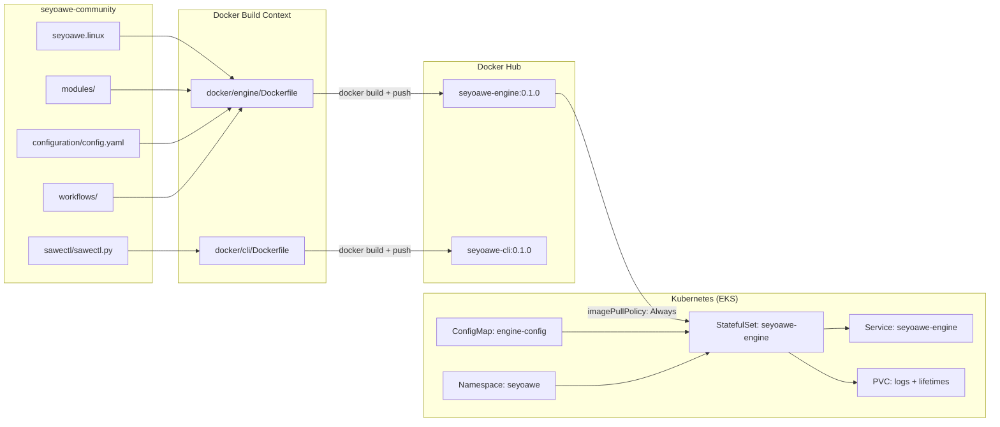

# Phase 1 + P5 Prereq: Design Log 0001

## Enforced Operational Rules (added 2026-03-27)

These four rules are strictly enforced for the entire project lifecycle:

### Rule 1 — Strict Sequential Naming
All files in `.cursor/design-logs/`, `.cursor/plans/`, `.cursor/helpers-scripts/`, `.cursor/logs/`, `.cursor/wip/` must use the `NNNN_<descriptive_name>.<ext>` format. Before creating any file, `ls` the target directory, identify the highest existing prefix, and increment by 1. Default to `0001_` if the directory is empty.

### Rule 2 — Mandatory Design Logs & Retroactive Updates
A Design Log must be written and approved before any implementation file is created for any phase. If a later phase invalidates or changes a prior design decision, append a clearly dated `## Retroactive Update — YYYY-MM-DD` section to the affected earlier log. Documentation must always reflect the current actual state.

### Rule 3 — Manual Action Hand-Off
When any action requires manual intervention (AWS Console, DockerHub login, GitHub Webhooks, Jenkins UI setup, IAM role creation, etc.), execution stops immediately. A numbered step-by-step instruction block is provided in this format:
- "Navigate to: [Exact URL]"
- "Click on [Button/Menu]"
- "Copy [X] and paste it in [Y]"

Execution resumes only after explicit "Done" or "Approved" confirmation from the user.

### Rule 4 — Git Branching (Never Work on Main)
No commits are made to `main` or `master` directly. Before any phase begins, a feature branch is created: `git checkout -b feature/phase<N>-<short-description>`. Merges to `main` happen only on explicit user instruction. Branch for Phase 1: `feature/phase1-containerization`.

---

## Context Summary

- **App repo**: `seyoawe-community` — engine binary `seyoawe.linux`, `sawectl/` Python CLI, `modules/`, `workflows/`, `configuration/config.yaml` (ports 8080 / 8081)
- **Infra repo**: `final-project-devops` — all infrastructure artifacts, design logs, plans, and scripts live here
- **Active branch**: `feature/phase1-containerization` (must be created and checked out by user before implementation begins)
- **Design log destination**: `final-project-devops/.cursor/design-logs/0001_phase1_containerization_k8s.md` (directory is empty → first file → `0001_`)
- **Execution constraint**: Zero infra files are created until design log `0001_` is written to disk and approved

---

## Recommended First Work Unit: P5 prerequisite + P1

The plan's dependency graph requires the `VERSION` file and `scripts/version.sh` (Phase 5) before any CI pipeline can run. Because these are lightweight artifacts (one file + one script), they are bundled into this first Design Log alongside Phase 1 (Containerization + K8s) as a single atomic work unit.

---

## Design Log: 0001_phase1_containerization_k8s.md

### 1. Background & Problem

`seyoawe.linux` is a pre-compiled closed-source binary. It has no buildable source; containerization must treat it as a COPY artifact.
The engine depends on runtime Python (modules are `.py` files), `configuration/config.yaml`, and `workflows/`. These must be present inside the image at runtime.
No Kubernetes manifests, Dockerfiles, or version tracking exist yet in `final-project-devops`. This is the foundational layer that all CI/CD pipelines build on.

### 2. Questions & Answers

- **Q: Does `/health` exist on the engine?** A: Unconfirmed from source — plan uses HTTP healthcheck on port 8080 with fallback TCP probe; integration tests (Phase 3) will verify.
- **Q: Is the engine stateful?** A: Yes — it writes lifetimes JSON + run logs per the README. StatefulSet with PVC is required.
- **Q: Should `config.yaml` be baked into the image or externalized?** A: Externalized via ConfigMap — allows per-environment overrides without rebuild.
- **Q: Docker Hub namespace?** A: Placeholder `<DOCKERHUB_USER>` — to be substituted at build time via `--build-arg`.
- **Q: Where does the VERSION file live?** A: Root of `final-project-devops/` — single source of truth for both engine and CLI image tags.

### 3. Design & Solution

**Files to create (Phase 5 prereq):**

- `final-project-devops/VERSION` — contains `0.1.0`
- `final-project-devops/scripts/version.sh` — detects which component changed via `git diff`, outputs `ENGINE_CHANGED=true/false` and `CLI_CHANGED=true/false`

**Files to create (Phase 1 — Containerization):**

- `final-project-devops/docker/engine/Dockerfile`
  - Base: `ubuntu:22.04`
  - Installs: `python3 python3-pip curl`
  - COPYs: `seyoawe.linux` → `/app/seyoawe`, `configuration/`, `modules/`, `workflows/`
  - `chmod +x`, `EXPOSE 8080 8081`
  - `HEALTHCHECK` on `:8080/health`
  - `ENTRYPOINT ["./seyoawe"]`
  - `ARG VERSION` → sets `LABEL version=$VERSION`
- `final-project-devops/docker/cli/Dockerfile`
  - Base: `python:3.10-slim`
  - COPYs `sawectl/` → `/app/`
  - `pip install -r requirements.txt`
  - `ENTRYPOINT ["python3", "sawectl.py"]`

**Files to create (Phase 1 — Kubernetes):**

- `final-project-devops/k8s/namespace.yaml` — `seyoawe` namespace
- `final-project-devops/k8s/engine-configmap.yaml` — externalizes `config.yaml`; `base_url` and `workdir` are env-overridable
- `final-project-devops/k8s/engine-statefulset.yaml`
  - `replicas: 1`, `serviceName: seyoawe-engine`
  - `volumeClaimTemplates`: 5Gi PVC for `/app/lifetimes` and `/app/logs`
  - `readinessProbe` + `livenessProbe`: HTTP GET `/health` :8080, `initialDelaySeconds: 15`
  - ConfigMap volume mount → `/app/configuration/config.yaml`
  - `resources.requests`: `cpu: 250m, memory: 512Mi`; `limits`: `cpu: 1, memory: 1Gi`
- `final-project-devops/k8s/engine-service.yaml` — ClusterIP, ports 8080 + 8081

**Flow diagram (to be embedded in log):**

### 4. Implementation Plan

**Step 1 — Version scaffold (P5 prereq)**

- Create `final-project-devops/VERSION` with content `0.1.0`
- Create `final-project-devops/scripts/version.sh` with git-diff-based change detection

**Step 2 — Engine Dockerfile**

- Create `final-project-devops/docker/engine/Dockerfile`
- Build context note: Jenkins pipeline will clone both repos and assemble build context from `seyoawe-community/`

**Step 3 — CLI Dockerfile**

- Create `final-project-devops/docker/cli/Dockerfile`

**Step 4 — K8s namespace**

- Create `final-project-devops/k8s/namespace.yaml`

**Step 5 — K8s ConfigMap**

- Create `final-project-devops/k8s/engine-configmap.yaml` (config.yaml content adapted for K8s paths)

**Step 6 — K8s StatefulSet**

- Create `final-project-devops/k8s/engine-statefulset.yaml` (PVC, probes, resource limits)

**Step 7 — K8s Service**

- Create `final-project-devops/k8s/engine-service.yaml`

**Step 8 — Verify (local smoke test, no EKS needed)**

- `docker build -f docker/engine/Dockerfile --build-arg VERSION=0.1.0 -t seyoawe-engine:0.1.0 <context>`
- `docker run -p 8080:8080 seyoawe-engine:0.1.0` → check port binding
- `kubectl apply --dry-run=client -f k8s/` → validate manifests

### 5. Trade-offs

- **Ubuntu 22.04 vs Alpine**: Ubuntu chosen because `seyoawe.linux` is a compiled binary that may depend on glibc — Alpine uses musl which can break binary compatibility. Trade-off: larger image (~100MB vs ~15MB), but guaranteed runtime compatibility.
- **StatefulSet vs Deployment**: StatefulSet required per project spec and justified by persistent state (lifetimes JSON, run logs). Trade-off: more complex rollout, no rolling restart without care.
- **ConfigMap for config.yaml**: Allows per-environment values without rebuilding the image. Trade-off: config changes require pod restart (acceptable — StatefulSet rollout).
- **ClusterIP vs LoadBalancer**: ClusterIP for now — load balancer exposure handled at ingress layer (or via CD pipeline later). No external IP cost at this stage.

### 6. Verification Criteria

- `docker build` completes without error for both engine and CLI Dockerfiles
- `docker run seyoawe-engine:0.1.0` — process starts, port 8080 binds (confirmed via `docker ps`)
- `kubectl apply --dry-run=client -f k8s/` — all 4 manifests validate with no errors
- `kubectl apply -f k8s/namespace.yaml && kubectl get ns seyoawe` — namespace created
- StatefulSet YAML passes `kubeval` or `kubectl --dry-run` schema validation
- `scripts/version.sh` exits 0 and prints correct `ENGINE_CHANGED` / `CLI_CHANGED` variables when run against a test git diff

---

## Destination File

`final-project-devops/.cursor/design-logs/0001_phase1_containerization_k8s.md`

(Prefix `0001_` confirmed — design-logs directory is empty → first file defaults to `0001_` per Rule 1.)

## Execution Gate Sequence (per enforced rules)

1. **User** runs `git checkout -b feature/phase1-containerization` in `final-project-devops` (Rule 4)
2. **User** confirms "Done"
3. **Agent** writes `0001_phase1_containerization_k8s.md` to `final-project-devops/.cursor/design-logs/` (Rule 2)
4. **User** reviews and approves the Design Log
5. **Agent** implements all files listed in the Implementation Plan (Steps 1–7)
6. **Agent** stops at any manual action step and provides hand-off instructions (Rule 3)
7. **Agent** commits all changes to `feature/phase1-containerization` only (Rule 4)
